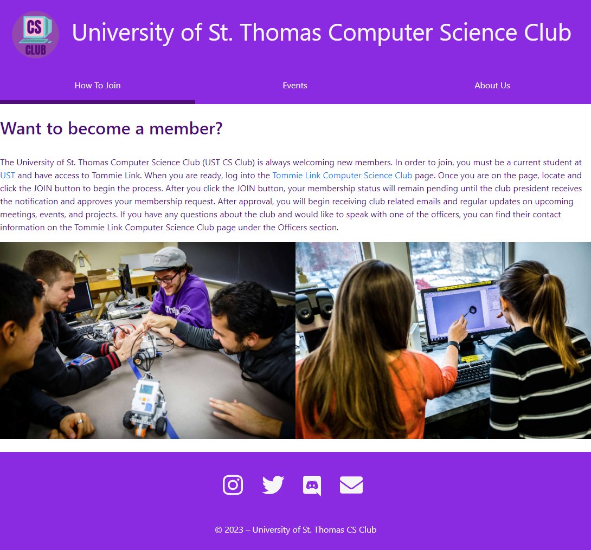

UST CS Club Website
===================

The University of St. Thomas Computer Science Club (UST CS Club) website is a project designed to provide information about the club, its events, and how to join. The website is created using HTML, CSS, and JavaScript, along with the Bootstrap framework for responsive design. It features a clean, modern design and is easy to navigate for users to find the information they need.

Table of Contents
-----------------
- [Website Features](#website-features)
- [Requirements](#requirements)
- [Running the Website Locally](#running-the-website-locally)
- [Code Structure](#code-structure)
- [Contributing](#contributing)
- [License](#license)

Website Features
----------------
- Responsive design using the Bootstrap framework
- Consistent header and footer across all pages
- Navigation menu with links to How To Join, Events, and About Us pages
- Detailed instructions on joining the club
- Embedded Twitter feed for event updates
- Google Maps integration on the About Us page

Requirements
------------
To run the website locally, you'll need the following software:
- A modern web browser (Google Chrome, Mozilla Firefox, Microsoft Edge, etc.)
- A code editor (Visual Studio Code, Atom, Sublime Text, etc.)
- A local web server (such as Live Server for Visual Studio Code)

Running the Website Locally
---------------------------
1. Start by cloning the repository to your local machine:
```
git clone https://github.com/osxzxso/cs-club.git
```
Alternatively, you can download the repository as a ZIP file and extract it to a desired location.

2. Open the project folder in your code editor.

3. If using Visual Studio Code, install the Live Server extension (if you haven't already), right-click index.html, and select "Open with Live Server".

If using another code editor or web server, follow the respective instructions for launching a local web server.

4. Navigate to the specified URL (usually http://localhost:5500 or http://127.0.0.1:5500) in your web browser to view the website.

Code Structure
--------------
The code is organized in the following structure:

- `index.html`: Contains the HTML structure and all the necessary JavaScript and CSS imports for the How To Join page.
- `events.html`: Contains the HTML structure for the Events page.
- `about_us.html`: Contains the HTML structure for the About Us page.
- `style.css`: Contains the basic styling for the HTML elements and layout.

All the assets (images, icons) are stored in the `images` folder.

Contributing
------------
Contributions are welcome! If you'd like to contribute, please follow these steps:

1. Fork the repository.
2. Clone your forked repository to make changes.
3. Create a new branch for your feature or bug fix.
4. Commit your changes and push them to your fork.
5. Create a pull request to the original repository.

Please make sure your code follows best coding practices and include any necessary documentation.

License
-------
The UST CS Club Website is licensed under the MIT License. You are free to use, modify, and distribute this code, provided you include the license notice and follow its terms and conditions.
